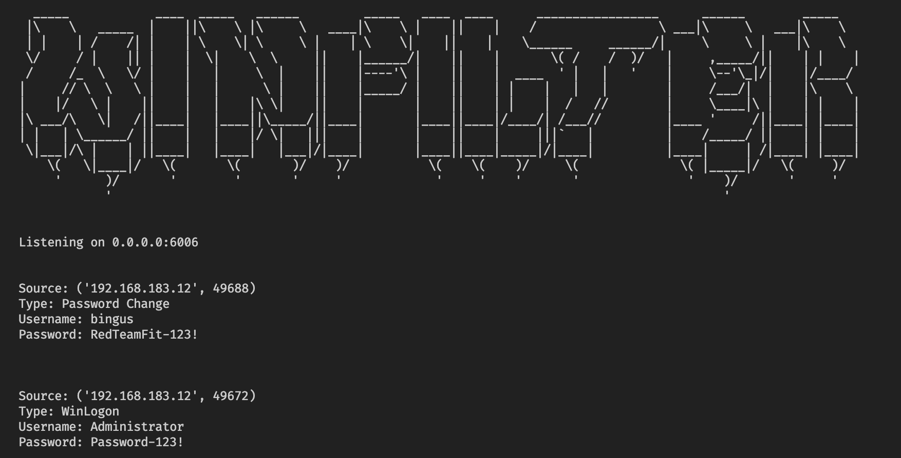

# WinFilter
Winlogon and LSA Notification Password Filters 

## Usage
### Building
Mingw is used to compile each dll. Install on your system before compiling, and then use `make` to build each dll. Binaries will exist in `bin/`.

### Filters
1) Modify the IP (`$ipa`) and Port (`$pt`) that the filters will call back to in the `kindtime_key.ps1` script. 

2) Modify the name of the dll (`$dllname`) at the top of each filters' powershell installer scripts (`lsainstall.ps1` and `wlinstall.ps1`). Run the installers.

3) Move each filter dll into `C:\windows\system32`.

### Credentials Receiver
To receive creds and set up the server, run:

```sh
python3 winfilter.py
```

By default, the IP will be '0.0.0.0' and the port will be '80'. You can give a specific ip or port using `--ip <ip_addr>` or `--port <port_num>`.

Screenshot Example:
```python3 winfilter.py --port 6006```




### Sharing Creds
There are three options to share creds: `--pwnboard [URL]`, `--discord [URL]`, `--write`. Any of the options can be utilized at the same time. 